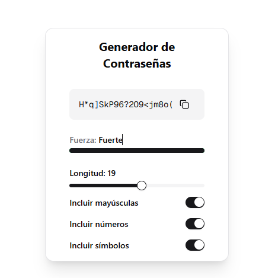

  

---
Me llamo Santiago, también conocido como "kopi", soy Desarrollador Full Stack Junior con muchas ganas de incoporarme a un equipo de trabajo donde pueda aportar y seguir creciendo. Me gusta también la Ciberseguridad, árean en la cuál estoy dando mis primeros pasos. Siempre busco aplicar lo que voy aprendiendo, explorar nuevas tecnologías y demostrar de mejorar manera mis habilidades.

<h1 align="center"> Proyectos Trabajados </h1>

###  [Generador de Contraseñas](https://generador-password-amber.vercel.app/)
Aplicación web para generar contraseñas seguras personalizables (longitud y tipos de caracteres).

  

---

###  [Chat IA](https://chat-ia-nine.vercel.app/)
Chat IA que permite interactuar con un asistente virtual que puede responder preguntas, brindar información y ayudar con tareas cotidianas.

  

<h1 align="center">  Habilidades Técnicas </h1>

<h1 align="center">  Bases de Datos y Herramientas  </h1>

<h1 align="center"> Contacto </h1>

  <a href="https://www.linkedin.com/in/kopii/" target="_blank">LinkedIn</a> • 
  <a href="https://x.com/Sxntiagorg" target="_blank">X</a> • 
  <a href="https://github.com/devkopi" target="_blank">GitHub</a>

